# 実装ガイド - Claude Code AI Collaboration MCP Server

## TDD（テスト駆動開発）実践ガイド

### TDDサイクル

```mermaid
graph LR
    A[Red: 失敗するテストを書く] --> B[Green: テストを通す最小限のコード]
    B --> C[Refactor: コードを改善]
    C --> A
```



### 実装ルール

1. **テストファースト**: 実装前に必ずテストを書く
2. **最小実装**: テストを通す最小限のコードのみ書く
3. **リファクタリング**: テストが通った後にコードを改善
4. **継続的統合**: 小さな変更を頻繁にコミット

## 詳細実装ガイド

### Phase 1: 基盤構築

#### T001: プロジェクト初期設定

**🔴 Red Phase - テスト作成**

```typescript
// tests/setup.test.ts
describe('Project Setup', () => {
  test('should have correct Node.js version', () => {
    const nodeVersion = process.version;
    expect(nodeVersion).toMatch(/^v18\./);
  });

  test('should have TypeScript available', () => {
    expect(() => require('typescript')).not.toThrow();
  });

  test('should have Jest available', () => {
    expect(() => require('jest')).not.toThrow();
  });
});
```

**🟢 Green Phase - 最小実装**

package.json の作成:
```json
{
  "name": "claude-code-ai-collab-mcp",
  "version": "1.0.0",
  "description": "Claude Code AI Collaboration MCP Server",
  "main": "dist/index.js",
  "scripts": {
    "build": "tsc",
    "test": "jest",
    "test:watch": "jest --watch",
    "test:coverage": "jest --coverage",
    "lint": "eslint src/**/*.ts",
    "lint:fix": "eslint src/**/*.ts --fix",
    "dev": "nodemon src/index.ts",
    "start": "node dist/index.js"
  },
  "keywords": ["mcp", "ai", "collaboration", "claude"],
  "author": "Your Name",
  "license": "MIT",
  "engines": {
    "node": ">=18.0.0"
  }
}
```

**🔄 Refactor Phase**
- package.json の最適化
- scripts の調整
- 依存関係の整理

---

#### T002: TypeScript型定義システム

**🔴 Red Phase - テスト作成**

```typescript
// tests/types/common.test.ts
import { UUID, Timestamp, AIProvider, ProblemType } from '@/types/common';

describe('Common Types', () => {
  describe('UUID', () => {
    test('should accept valid UUID format', () => {
      const validUUID: UUID = '550e8400-e29b-41d4-a716-446655440000';
      expect(validUUID).toMatch(/^[0-9a-f]{8}-[0-9a-f]{4}-4[0-9a-f]{3}-[89ab][0-9a-f]{3}-[0-9a-f]{12}$/i);
    });
  });

  describe('Timestamp', () => {
    test('should accept ISO 8601 format', () => {
      const validTimestamp: Timestamp = '2024-01-15T10:30:00.000Z';
      expect(new Date(validTimestamp).toISOString()).toBe(validTimestamp);
    });
  });

  describe('AIProvider', () => {
    test('should include all supported providers', () => {
      const providers: AIProvider[] = ['deepseek', 'openai', 'o3', 'anthropic'];
      expect(providers).toHaveLength(4);
    });
  });
});

// tests/types/interfaces.test.ts
import { IAIProvider, ITool, IStrategy } from '@/types/interfaces';

describe('Interfaces', () => {
  describe('IAIProvider', () => {
    test('should define required methods', () => {
      // TypeScript コンパイル時にチェックされる
      const mockProvider: IAIProvider = {
        name: 'test',
        capabilities: {
          models: ['test-model'],
          max_tokens: 4096,
          languages: ['en']
        },
        initialize: jest.fn(),
        generateResponse: jest.fn(),
        validateRequest: jest.fn(),
        getHealthStatus: jest.fn(),
        dispose: jest.fn()
      };
      
      expect(mockProvider.name).toBe('test');
      expect(mockProvider.capabilities.models).toContain('test-model');
    });
  });
});
```

**🟢 Green Phase - 最小実装**

```typescript
// src/types/common.ts
export type UUID = string;
export type Timestamp = string;
export type LanguageCode = 'ja' | 'en' | 'zh' | 'ko' | 'es' | 'fr' | 'de';
export type ProgrammingLanguage = 'typescript' | 'javascript' | 'python' | 'java' | 'go' | 'rust';
export type AIProvider = 'deepseek' | 'openai' | 'o3' | 'anthropic';
export type ProblemType = 'coding' | 'debugging' | 'architecture' | 'algorithm' | 'optimization';

export interface ErrorDetail {
  code: string;
  message: string;
  details?: Record<string, any>;
  timestamp: Timestamp;
  stack?: string;
}

export interface TokenUsage {
  prompt_tokens: number;
  completion_tokens: number;
  total_tokens: number;
  estimated_cost?: number;
}

// src/types/interfaces.ts
import { AIProvider, ErrorDetail, TokenUsage, Timestamp, UUID } from './common';

export interface ProviderCapabilities {
  models: string[];
  max_tokens: number;
  supports_streaming?: boolean;
  supports_functions?: boolean;
  languages: LanguageCode[];
}

export interface HealthStatus {
  healthy: boolean;
  latency?: number;
  last_error?: ErrorDetail;
  uptime?: number;
}

export interface AIRequest {
  id: UUID;
  prompt: string;
  model?: string;
  temperature?: number;
  max_tokens?: number;
}

export interface AIResponse {
  id: UUID;
  provider: AIProvider;
  model: string;
  content: string;
  usage: TokenUsage;
  latency: number;
  finish_reason?: string;
}

export interface ValidationResult {
  valid: boolean;
  errors?: Array<{
    field: string;
    message: string;
    code: string;
  }>;
}

export interface IAIProvider {
  readonly name: AIProvider;
  readonly capabilities: ProviderCapabilities;
  
  initialize(config: any): Promise<void>;
  generateResponse(request: AIRequest): Promise<AIResponse>;
  validateRequest(request: AIRequest): ValidationResult;
  getHealthStatus(): Promise<HealthStatus>;
  dispose(): Promise<void>;
}

export interface ToolContext {
  request_id: UUID;
  user_id?: string;
  session_id?: string;
  environment?: Record<string, string>;
}

export interface ToolResult {
  success: boolean;
  data?: any;
  error?: ErrorDetail;
  metadata?: {
    request_id: UUID;
    timestamp: Timestamp;
    execution_time: number;
    [key: string]: any;
  };
}

export interface ITool {
  readonly name: string;
  readonly description: string;
  readonly input_schema: any; // JSONSchema
  
  execute(input: any, context: ToolContext): Promise<ToolResult>;
  validate(input: any): ValidationResult;
}

export interface IStrategy {
  readonly name: string;
  readonly description: string;
  
  execute(
    providers: IAIProvider[],
    request: any,
    context: any
  ): Promise<any>;
}
```

**🔄 Refactor Phase**
- 型の最適化と再利用性向上
- JSDoc コメントの追加
- エクスポートの整理

---

#### T003: 依存性注入コンテナ

**🔴 Red Phase - テスト作成**

```typescript
// tests/core/container.test.ts
import 'reflect-metadata';
import { Container } from 'inversify';
import { TYPES, createContainer } from '@/core/container';
import { ILogger } from '@/types/interfaces';

describe('DI Container', () => {
  let container: Container;

  beforeEach(() => {
    container = createContainer();
  });

  test('should resolve logger service', () => {
    const logger = container.get<ILogger>(TYPES.Logger);
    expect(logger).toBeDefined();
    expect(typeof logger.info).toBe('function');
    expect(typeof logger.error).toBe('function');
  });

  test('should maintain singleton scope for logger', () => {
    const logger1 = container.get<ILogger>(TYPES.Logger);
    const logger2 = container.get<ILogger>(TYPES.Logger);
    expect(logger1).toBe(logger2);
  });

  test('should detect circular dependencies', () => {
    // 循環依存のテストケースを後で追加
    expect(true).toBe(true);
  });
});
```

**🟢 Green Phase - 最小実装**

```typescript
// src/core/container.ts
import 'reflect-metadata';
import { Container } from 'inversify';

export const TYPES = {
  Logger: Symbol.for('ILogger'),
  MetricsCollector: Symbol.for('IMetricsCollector'),
  CacheManager: Symbol.for('ICache'),
  ProviderManager: Symbol.for('ProviderManager'),
  StrategyManager: Symbol.for('StrategyManager'),
  ToolManager: Symbol.for('ToolManager'),
  ConfigManager: Symbol.for('ConfigManager'),
  ErrorManager: Symbol.for('ErrorManager'),
} as const;

export function createContainer(): Container {
  const container = new Container();
  
  // 基本的なバインディングのみ
  // 実際の実装は各コンポーネント実装時に追加
  
  return container;
}

export { Container };
```

---

#### T004: 構造化ログシステム

**🔴 Red Phase - テスト作成**

```typescript
// tests/core/logger.test.ts
import { Logger } from '@/core/logger';
import { LogLevel } from '@/types/common';

describe('Logger', () => {
  let logger: Logger;
  let mockTransport: any;

  beforeEach(() => {
    mockTransport = {
      log: jest.fn()
    };
    logger = new Logger({
      level: 'debug',
      transports: [mockTransport]
    });
  });

  test('should log info messages', () => {
    logger.info('Test message', { userId: '123' });
    
    expect(mockTransport.log).toHaveBeenCalledWith(
      expect.objectContaining({
        level: 'info',
        message: 'Test message',
        metadata: { userId: '123' }
      })
    );
  });

  test('should filter logs by level', () => {
    const warnLogger = new Logger({
      level: 'warn',
      transports: [mockTransport]
    });
    
    warnLogger.debug('Debug message');
    warnLogger.warn('Warning message');
    
    expect(mockTransport.log).toHaveBeenCalledTimes(1);
    expect(mockTransport.log).toHaveBeenCalledWith(
      expect.objectContaining({
        level: 'warn',
        message: 'Warning message'
      })
    );
  });

  test('should create child logger with context', () => {
    const childLogger = logger.child({ requestId: 'req-123' });
    childLogger.info('Child message');
    
    expect(mockTransport.log).toHaveBeenCalledWith(
      expect.objectContaining({
        metadata: expect.objectContaining({
          requestId: 'req-123'
        })
      })
    );
  });

  test('should mask sensitive information', () => {
    logger.info('API call', { apiKey: 'sk-secret123' });
    
    expect(mockTransport.log).toHaveBeenCalledWith(
      expect.objectContaining({
        metadata: expect.objectContaining({
          apiKey: '***MASKED***'
        })
      })
    );
  });
});
```

**🟢 Green Phase - 最小実装**

```typescript
// src/types/common.ts (追加)
export type LogLevel = 'debug' | 'info' | 'warn' | 'error' | 'fatal';

export interface LogEntry {
  timestamp: string;
  level: LogLevel;
  message: string;
  metadata?: Record<string, any>;
  requestId?: string;
  error?: Error;
}

// src/types/interfaces.ts (追加)
export interface ILogger {
  debug(message: string, metadata?: any): void;
  info(message: string, metadata?: any): void;
  warn(message: string, metadata?: any): void;
  error(message: string, error?: Error, metadata?: any): void;
  fatal(message: string, error?: Error, metadata?: any): void;
  child(metadata: any): ILogger;
}

// src/core/logger.ts
import { ILogger, LogLevel, LogEntry } from '@/types';

interface LoggerConfig {
  level: LogLevel;
  transports: LogTransport[];
}

interface LogTransport {
  log(entry: LogEntry): void;
}

export class Logger implements ILogger {
  private config: LoggerConfig;
  private context: Record<string, any> = {};

  constructor(config: LoggerConfig) {
    this.config = config;
  }

  debug(message: string, metadata?: any): void {
    this.log('debug', message, undefined, metadata);
  }

  info(message: string, metadata?: any): void {
    this.log('info', message, undefined, metadata);
  }

  warn(message: string, metadata?: any): void {
    this.log('warn', message, undefined, metadata);
  }

  error(message: string, error?: Error, metadata?: any): void {
    this.log('error', message, error, metadata);
  }

  fatal(message: string, error?: Error, metadata?: any): void {
    this.log('fatal', message, error, metadata);
  }

  child(metadata: any): ILogger {
    const childLogger = new Logger(this.config);
    childLogger.context = { ...this.context, ...metadata };
    return childLogger;
  }

  private log(level: LogLevel, message: string, error?: Error, metadata?: any): void {
    if (!this.shouldLog(level)) {
      return;
    }

    const entry: LogEntry = {
      timestamp: new Date().toISOString(),
      level,
      message,
      metadata: this.maskSensitiveData({ ...this.context, ...metadata }),
      error
    };

    this.config.transports.forEach(transport => {
      transport.log(entry);
    });
  }

  private shouldLog(level: LogLevel): boolean {
    const levels = ['debug', 'info', 'warn', 'error', 'fatal'];
    const currentLevelIndex = levels.indexOf(this.config.level);
    const messageLevelIndex = levels.indexOf(level);
    return messageLevelIndex >= currentLevelIndex;
  }

  private maskSensitiveData(data: any): any {
    if (!data || typeof data !== 'object') {
      return data;
    }

    const sensitiveKeys = ['apiKey', 'password', 'token', 'secret'];
    const masked = { ...data };

    for (const key of Object.keys(masked)) {
      if (sensitiveKeys.some(sensitive => 
        key.toLowerCase().includes(sensitive.toLowerCase())
      )) {
        masked[key] = '***MASKED***';
      }
    }

    return masked;
  }
}
```

**🔄 Refactor Phase**
- Winstonライブラリの統合
- ログローテーション機能の追加
- パフォーマンス最適化

---

### Phase 2: コア機能実装のベストプラクティス

#### 実装パターン

**1. Factory Pattern for Providers**
```typescript
// tests/providers/provider-factory.test.ts
describe('ProviderFactory', () => {
  test('should create DeepSeek provider', () => {
    const factory = new ProviderFactory();
    const provider = factory.createProvider({
      name: 'deepseek',
      type: 'deepseek',
      api_key: 'test-key'
    });
    
    expect(provider.name).toBe('deepseek');
    expect(provider).toBeInstanceOf(DeepSeekProvider);
  });
});

// Implementation
export class ProviderFactory {
  createProvider(config: ProviderConfig): IAIProvider {
    switch (config.type) {
      case 'deepseek':
        return new DeepSeekProvider(config);
      case 'openai':
        return new OpenAIProvider(config);
      default:
        throw new Error(`Unknown provider type: ${config.type}`);
    }
  }
}
```

**2. Strategy Pattern for Execution**
```typescript
// tests/strategies/strategy-manager.test.ts
describe('StrategyManager', () => {
  test('should execute parallel strategy', async () => {
    const manager = new StrategyManager();
    const mockProviders = [mockDeepSeek, mockOpenAI];
    const request = { prompt: 'Test prompt' };
    
    const result = await manager.executeStrategy(
      'parallel',
      mockProviders,
      request,
      context
    );
    
    expect(result.success).toBe(true);
    expect(result.results).toHaveLength(2);
  });
});
```

**3. Decorator Pattern for Cross-cutting Concerns**
```typescript
// tests/providers/decorators/retry.test.ts
describe('RetryDecorator', () => {
  test('should retry on failure', async () => {
    const mockProvider = createMockProvider();
    mockProvider.generateResponse
      .mockRejectedValueOnce(new Error('Network error'))
      .mockResolvedValueOnce(mockResponse);
    
    const decoratedProvider = new RetryDecorator(mockProvider, {
      maxAttempts: 3,
      initialDelay: 100
    });
    
    const result = await decoratedProvider.generateResponse(mockRequest);
    
    expect(mockProvider.generateResponse).toHaveBeenCalledTimes(2);
    expect(result).toEqual(mockResponse);
  });
});
```

### エラーハンドリングのベストプラクティス

#### 1. 型安全なエラーハンドリング

```typescript
// src/utils/result.ts
export type Result<T, E = Error> = 
  | { success: true; data: T }
  | { success: false; error: E };

export const Ok = <T>(data: T): Result<T, never> => ({ success: true, data });
export const Err = <E>(error: E): Result<never, E> => ({ success: false, error });

// 使用例
async function callProvider(request: AIRequest): Promise<Result<AIResponse, ProviderError>> {
  try {
    const response = await provider.generateResponse(request);
    return Ok(response);
  } catch (error) {
    return Err(new ProviderError('Failed to call provider', error));
  }
}
```

#### 2. エラーのカテゴリ化

```typescript
// src/errors/index.ts
export abstract class BaseError extends Error {
  abstract readonly code: string;
  abstract readonly httpStatus: number;
  readonly timestamp: string;
  
  constructor(message: string, public readonly cause?: Error) {
    super(message);
    this.name = this.constructor.name;
    this.timestamp = new Date().toISOString();
  }
}

export class ProviderError extends BaseError {
  readonly code = 'PROVIDER_ERROR';
  readonly httpStatus = 502;
  
  constructor(message: string, public readonly provider: string, cause?: Error) {
    super(message, cause);
  }
}

export class ValidationError extends BaseError {
  readonly code = 'VALIDATION_ERROR';
  readonly httpStatus = 400;
  
  constructor(message: string, public readonly violations: ValidationViolation[]) {
    super(message);
  }
}
```

### テストのベストプラクティス

#### 1. テストユーティリティ

```typescript
// tests/utils/test-helpers.ts
export function createMockProvider(name: AIProvider = 'test'): jest.Mocked<IAIProvider> {
  return {
    name,
    capabilities: {
      models: ['test-model'],
      max_tokens: 4096,
      languages: ['en']
    },
    initialize: jest.fn().mockResolvedValue(undefined),
    generateResponse: jest.fn(),
    validateRequest: jest.fn().mockReturnValue({ valid: true }),
    getHealthStatus: jest.fn().mockResolvedValue({ healthy: true }),
    dispose: jest.fn().mockResolvedValue(undefined)
  };
}

export function createMockRequest(): AIRequest {
  return {
    id: 'test-id',
    prompt: 'Test prompt',
    model: 'test-model',
    temperature: 0.7,
    max_tokens: 1000
  };
}

export function createMockResponse(): AIResponse {
  return {
    id: 'test-id',
    provider: 'test',
    model: 'test-model',
    content: 'Test response',
    usage: {
      prompt_tokens: 10,
      completion_tokens: 20,
      total_tokens: 30
    },
    latency: 1000
  };
}
```

#### 2. 統合テストパターン

```typescript
// tests/integration/end-to-end.test.ts
describe('End-to-End Tests', () => {
  let server: MCPServer;
  let container: Container;

  beforeAll(async () => {
    container = createTestContainer();
    server = container.get<MCPServer>(TYPES.MCPServer);
    await server.initialize();
  });

  afterAll(async () => {
    await server.shutdown();
  });

  test('should handle collaboration request', async () => {
    const request = {
      tool: 'collaborate_on_problem',
      arguments: {
        problem_description: 'How to implement binary search?',
        problem_type: 'algorithm',
        preferred_providers: ['deepseek', 'openai']
      }
    };

    const response = await server.handleToolCall(request);

    expect(response.success).toBe(true);
    expect(response.data).toHaveProperty('responses');
    expect(response.data.responses).toHaveLength(2);
    expect(response.data).toHaveProperty('synthesis');
  });
});
```

### 継続的改善のガイドライン

#### 1. コード品質メトリクス

```javascript
// jest.config.js (品質閾値)
module.exports = {
  // ... other config
  coverageThreshold: {
    global: {
      branches: 85,
      functions: 85,
      lines: 85,
      statements: 85
    },
    './src/core/': {
      branches: 90,
      functions: 90,
      lines: 90,
      statements: 90
    }
  }
};
```

#### 2. パフォーマンス監視

```typescript
// tests/performance/benchmark.test.ts
describe('Performance Benchmarks', () => {
  test('parallel strategy should complete within time limit', async () => {
    const startTime = Date.now();
    
    await strategyManager.executeStrategy('parallel', providers, request, context);
    
    const duration = Date.now() - startTime;
    expect(duration).toBeLessThan(15000); // 15秒以内
  });

  test('cache hit should be fast', async () => {
    // キャッシュにデータを設定
    await cache.set('test-key', testData);
    
    const startTime = Date.now();
    const result = await cache.get('test-key');
    const duration = Date.now() - startTime;
    
    expect(result).toEqual(testData);
    expect(duration).toBeLessThan(100); // 100ms以内
  });
});
```

このガイドに従って、各フェーズを段階的に実装していきます。