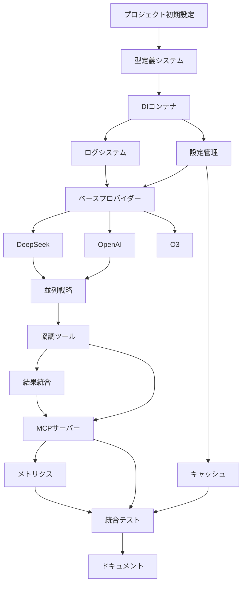

# Claude Code AI Collaboration MCP Server - 実装計画

## プロジェクト概要

複数のAIプロバイダー（DeepSeek、OpenAI、O3、Anthropic）と協調して問題解決を行うMCPサーバーの実装。

**見積もり総工数**: 40-50人日  
**実装期間**: 8-10週間（1人で作業）  
**主要技術**: TypeScript, Node.js, MCP Protocol, Jest

## フェーズ別実装計画

### Phase 1: 基盤構築 (Week 1-2)
基本的なプロジェクト構造と型システムを構築

### Phase 2: コア機能 (Week 3-4)
依存性注入、ログ、設定管理などのコア機能を実装

### Phase 3: プロバイダー層 (Week 5-6)
各AIプロバイダーとの連携機能を実装

### Phase 4: ツール・戦略 (Week 7-8)
MCPツールと実行戦略を実装

### Phase 5: 統合・最適化 (Week 9-10)
統合テスト、パフォーマンス最適化、ドキュメント整備

---

## 詳細タスクチケット

### T001: プロジェクト初期設定
**フェーズ**: Phase 1  
**優先度**: Critical  
**見積もり**: 0.5人日  
**依存関係**: なし

#### 作業内容
- [ ] プロジェクトディレクトリ構造の作成
- [ ] package.json の設定（依存関係、スクリプト）
- [ ] TypeScript設定（tsconfig.json）
- [ ] ESLint/Prettier設定
- [ ] Jest設定
- [ ] .gitignore設定

#### 成果物
```
claude-code-ai-collab-mcp/
├── package.json
├── tsconfig.json
├── .eslintrc.js
├── .prettierrc
├── jest.config.js
├── .gitignore
└── src/
```

#### テスト基準
- [x] `npm install` が正常に完了する
- [x] `npm run build` が正常に完了する
- [x] `npm test` が正常に実行される

---

### T002: TypeScript型定義システム
**フェーズ**: Phase 1  
**優先度**: Critical  
**見積もり**: 2人日  
**依存関係**: T001

#### 作業内容
- [ ] 基本型定義（src/types/common.ts）
- [ ] インターフェース定義（src/types/interfaces.ts）
- [ ] JSONスキーマ定義（src/types/schemas.ts）
- [ ] 型定義のユニットテスト

#### 詳細仕様
1. **common.ts**
   - 基本型（UUID, Timestamp, LanguageCode など）
   - エンティティ型（ErrorDetail, TokenUsage など）
   - エニュメーション型（AIProvider, ProblemType など）

2. **interfaces.ts**
   - コアインターフェース（IAIProvider, ITool, IStrategy など）
   - サービスインターフェース（ICache, ILogger, IMetricsCollector など）

3. **schemas.ts**
   - 入力バリデーション用JSONスキーマ
   - MCP Tool Schema定義

#### テストケース
```typescript
// tests/types/common.test.ts
describe('Common Types', () => {
  test('UUID型は正しい形式を受け入れる', () => {
    const validUUID: UUID = 'xxxxxxxx-xxxx-4xxx-yxxx-xxxxxxxxxxxx';
    expect(isValidUUID(validUUID)).toBe(true);
  });
});
```

#### 成果物
- `src/types/common.ts` (150行)
- `src/types/interfaces.ts` (300行)
- `src/types/schemas.ts` (200行)
- `src/types/index.ts` (エクスポート)
- `tests/types/` 配下のテストファイル

---

### T003: 依存性注入コンテナ
**フェーズ**: Phase 2  
**優先度**: Critical  
**見積もり**: 1人日  
**依存関係**: T002

#### 作業内容
- [ ] InversifyJSベースのDIコンテナ設定
- [ ] TYPES定義（依存性識別子）
- [ ] コンテナ設定とバインディング
- [ ] DIコンテナのテスト

#### 詳細仕様
```typescript
// src/core/container.ts
const TYPES = {
  Logger: Symbol.for('ILogger'),
  MetricsCollector: Symbol.for('IMetricsCollector'),
  CacheManager: Symbol.for('ICache'),
  ProviderManager: Symbol.for('ProviderManager'),
  StrategyManager: Symbol.for('StrategyManager'),
  ToolManager: Symbol.for('ToolManager'),
};
```

#### テストケース
- コンテナからサービスが正しく解決される
- 循環依存が検出される
- シングルトンスコープが正しく動作する

---

### T004: 構造化ログシステム
**フェーズ**: Phase 2  
**優先度**: High  
**見積もり**: 1人日  
**依存関係**: T003

#### 作業内容
- [ ] Winstonベースのロガー実装
- [ ] 構造化ログフォーマット
- [ ] ログレベル管理
- [ ] ログローテーション設定
- [ ] ロガーのテスト

#### 詳細仕様
```typescript
interface LogEntry {
  timestamp: string;
  level: LogLevel;
  message: string;
  metadata?: Record<string, any>;
  requestId?: string;
  provider?: string;
  tool?: string;
}
```

#### テストケース
- ログレベルフィルタリングが正しく動作する
- 構造化ログが正しいフォーマットで出力される
- ログローテーションが設定通りに動作する

---

### T005: 設定管理システム
**フェーズ**: Phase 2  
**優先度**: High  
**見積もり**: 1.5人日  
**依存関係**: T003

#### 作業内容
- [ ] node-configベースの設定管理
- [ ] 環境変数の処理
- [ ] 設定スキーマバリデーション
- [ ] 設定ファイルテンプレート作成
- [ ] 設定管理のテスト

#### 設定ファイル構造
```yaml
# config/default.yaml
server:
  name: claude-code-ai-collab-mcp
  version: 1.0.0
  log_level: info

providers:
  - name: deepseek
    enabled: true
    api_key: ${DEEPSEEK_API_KEY}
```

#### テストケース
- 環境変数が正しく展開される
- 設定バリデーションが動作する
- デフォルト値が適用される

---

### T006: ベースプロバイダークラス
**フェーズ**: Phase 3  
**優先度**: Critical  
**見積もり**: 2人日  
**依存関係**: T004, T005

#### 作業内容
- [ ] IAIProviderインターフェースの実装
- [ ] BaseProviderクラス（共通機能）
- [ ] リトライ機能
- [ ] レート制限機能
- [ ] エラーハンドリング
- [ ] ベースプロバイダーのテスト

#### 詳細仕様
```typescript
abstract class BaseProvider implements IAIProvider {
  abstract readonly name: AIProvider;
  abstract readonly capabilities: ProviderCapabilities;
  
  protected rateLimiter: IRateLimiter;
  protected retryHandler: IRetryHandler;
  
  async generateResponse(request: AIRequest): Promise<AIResponse> {
    return await this.executeWithRetry(async () => {
      await this.rateLimiter.checkLimit();
      return await this.callProvider(request);
    });
  }
  
  protected abstract callProvider(request: AIRequest): Promise<AIResponse>;
}
```

#### テストケース
- リトライロジックが正しく動作する
- レート制限が適用される
- エラーハンドリングが動作する
- 各プロバイダーが基底クラスから継承できる

---

### T007: DeepSeekプロバイダー実装
**フェーズ**: Phase 3  
**優先度**: High  
**見積もり**: 1.5人日  
**依存関係**: T006

#### 作業内容
- [ ] DeepSeek API クライアント実装
- [ ] DeepSeekProviderクラス
- [ ] モデル固有の設定
- [ ] API レスポンスのパース
- [ ] DeepSeekプロバイダーのテスト

#### API仕様
```typescript
interface DeepSeekRequest {
  model: string;
  messages: Array<{
    role: 'system' | 'user' | 'assistant';
    content: string;
  }>;
  temperature?: number;
  max_tokens?: number;
}
```

#### テストケース
- モックAPIサーバーでの統合テスト
- エラーレスポンスの処理
- レート制限の処理

---

### T008: OpenAIプロバイダー実装
**フェーズ**: Phase 3  
**優先度**: High  
**見積もり**: 1.5人日  
**依存関係**: T006

#### 作業内容
- [ ] OpenAI API クライアント実装
- [ ] OpenAIProviderクラス
- [ ] 関数呼び出し機能
- [ ] ストリーミング対応
- [ ] OpenAIプロバイダーのテスト

---

### T009: O3プロバイダー実装（Web検索付き）
**フェーズ**: Phase 3  
**優先度**: Medium  
**見積もり**: 2人日  
**依存関係**: T006

#### 作業内容
- [ ] O3 API クライアント実装
- [ ] Web検索エンジン統合（Brave Search）
- [ ] 検索結果の前処理
- [ ] O3Providerクラス
- [ ] O3プロバイダーのテスト

#### 特殊機能
- Web検索クエリの自動生成
- 検索結果のフィルタリングと要約
- コンテキストサイズの管理

---

### T010: 並列実行戦略
**フェーズ**: Phase 4  
**優先度**: Critical  
**見積もり**: 1.5人日  
**依存関係**: T007, T008

#### 作業内容
- [ ] IStrategyインターフェース実装
- [ ] ParallelStrategyクラス
- [ ] 同時実行制御
- [ ] 結果収集とタイムアウト処理
- [ ] 並列戦略のテスト

#### 詳細仕様
```typescript
class ParallelStrategy implements IStrategy {
  async execute(
    providers: IAIProvider[],
    request: any,
    context: StrategyContext
  ): Promise<StrategyResult> {
    const promises = providers.map(provider =>
      this.executeWithTimeout(provider, request, context.timeout)
    );
    
    const results = await Promise.allSettled(promises);
    return this.processResults(results);
  }
}
```

---

### T011: 協調問題解決ツール
**フェーズ**: Phase 4  
**優先度**: Critical  
**見積もり**: 3人日  
**依存関係**: T010

#### 作業内容
- [ ] ITool インターフェース実装
- [ ] CollaborateToolクラス
- [ ] プロンプト最適化
- [ ] 結果統合ロジック
- [ ] 協調ツールのテスト

#### 詳細機能
- 問題タイプ別プロンプト生成
- 複数AIの回答統合
- コンセンサス計算
- 推奨事項の生成

---

### T012: 結果統合サービス
**フェーズ**: Phase 4  
**優先度**: High  
**見積もり**: 2人日  
**依存関係**: T011

#### 作業内容
- [ ] SynthesisServiceクラス
- [ ] パターン分析アルゴリズム
- [ ] 競合解決ロジック
- [ ] 統合サービスのテスト

---

### T013: MCPサーバーメインクラス
**フェーズ**: Phase 4  
**優先度**: Critical  
**見積もり**: 2人日  
**依存関係**: T011, T012

#### 作業内容
- [ ] MCPサーバー実装
- [ ] ツールハンドラー登録
- [ ] リクエスト/レスポンス処理
- [ ] エラーハンドリング
- [ ] サーバーのテスト

---

### T014: キャッシュシステム
**フェーズ**: Phase 5  
**優先度**: Medium  
**見積もり**: 1.5人日  
**依存関係**: T005

#### 作業内容
- [ ] ICacheインターフェース実装
- [ ] MemoryCacheクラス
- [ ] RedisCacheクラス
- [ ] キャッシュキー生成
- [ ] TTL管理
- [ ] キャッシュのテスト

---

### T015: メトリクス・監視システム
**フェーズ**: Phase 5  
**優先度**: Medium  
**見積もり**: 2人日  
**依存関係**: T013

#### 作業内容
- [ ] IMetricsCollectorインターフェース実装
- [ ] Prometheusメトリクス
- [ ] ヘルスチェック機能
- [ ] パフォーマンス監視
- [ ] 監視システムのテスト

---

### T016: 統合テスト
**フェーズ**: Phase 5  
**優先度**: High  
**見積もり**: 3人日  
**依存関係**: T013, T014, T015

#### 作業内容
- [ ] エンドツーエンドテスト
- [ ] パフォーマンステスト
- [ ] エラーシナリオテスト
- [ ] 負荷テスト
- [ ] セキュリティテスト

---

### T017: ドキュメント整備
**フェーズ**: Phase 5  
**優先度**: Medium  
**見積もり**: 2人日  
**依存関係**: T016

#### 作業内容
- [ ] README.md
- [ ] API ドキュメント
- [ ] 設定ガイド
- [ ] トラブルシューティング
- [ ] 使用例とチュートリアル

---

## 依存関係マップ



## リスク管理

### 高リスク項目
1. **API制限**: 各プロバイダーのAPI制限による開発遅延
   - **対策**: モックサーバーでの開発、段階的な実装

2. **複雑性**: 複数AIの統合による予期しない動作
   - **対策**: 小さな単位での段階的統合、十分なテスト

3. **パフォーマンス**: 複数API呼び出しによるレイテンシ
   - **対策**: 並列処理、キャッシュの活用

### 中リスク項目
1. **設定の複雑さ**: 多数の設定項目による運用の複雑化
2. **デバッグの困難さ**: 分散処理によるデバッグの複雑化

## 実装ガイドライン

### TDD (テスト駆動開発)
1. **Red**: 失敗するテストを最初に書く
2. **Green**: テストを通す最小限のコードを書く
3. **Refactor**: コードを改善する

### コード品質基準
- テストカバレッジ: 80%以上
- ESLint違反: 0件
- TypeScript strict モード対応
- 全API のドキュメント化

### レビュー基準
- 機能要件の満足
- エラーハンドリングの適切性
- パフォーマンスの考慮
- セキュリティの確保
- 保守性の確保

## 進捗管理

### マイルストーン
- **M1 (Week 2)**: 基盤構築完了
- **M2 (Week 4)**: コア機能完了
- **M3 (Week 6)**: プロバイダー層完了
- **M4 (Week 8)**: ツール・戦略完了
- **M5 (Week 10)**: 製品リリース準備完了

### 週次レビュー項目
- 進捗状況の確認
- 技術的課題の解決
- 品質指標の確認
- リスクの評価と対策

---

このドキュメントは実装の進行に合わせて更新され、各タスクの詳細と進捗を管理します。