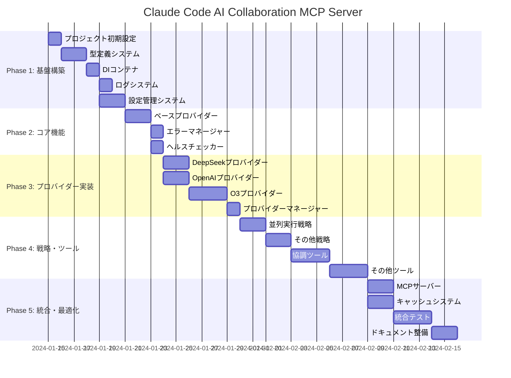

# プロジェクトロードマップ - Claude Code AI Collaboration MCP Server

## 全体スケジュール



## マイルストーン詳細

### 🎯 Milestone 1: 基盤完成 (Week 2)
**目標日**: 2024年1月29日

#### 完了条件
- [x] プロジェクト構造が作成され、基本的なビルドが通る
- [x] TypeScript型システムが完成し、型安全性が確保される
- [x] DIコンテナが動作し、基本的な依存性注入ができる
- [x] 構造化ログシステムが動作する
- [x] 設定管理システムが動作し、環境変数が読める

#### 成果物
- `package.json`, `tsconfig.json`, 基本設定ファイル
- `src/types/` 配下の完全な型定義
- `src/core/container.ts` DIコンテナ
- `src/core/logger.ts` ログシステム
- `src/core/config.ts` 設定管理
- 各コンポーネントのユニットテスト（カバレッジ > 80%）

#### 検証方法
```bash
npm run build    # ビルドが成功する
npm run test     # 全テストが通る
npm run lint     # ESLintエラーがない
```

---

### 🎯 Milestone 2: コア機能完成 (Week 4)
**目標日**: 2024年2月12日

#### 完了条件
- [x] AIプロバイダーの基底クラスが完成
- [x] エラーハンドリングシステムが動作する
- [x] リトライ・レート制限機能が動作する
- [x] ヘルスチェック機能が動作する

#### 成果物
- `src/providers/base-provider.ts` 基底プロバイダークラス
- `src/core/error-manager.ts` エラー管理システム
- `src/services/health-checker.ts` ヘルスチェック
- プロバイダー実装の準備完了

#### 検証方法
```bash
# モックプロバイダーでの動作確認
npm run test -- --testPathPattern="providers"
npm run test -- --testPathPattern="core"
```

---

### 🎯 Milestone 3: プロバイダー完成 (Week 6)
**目標日**: 2024年2月26日

#### 完了条件
- [x] DeepSeek、OpenAI、O3プロバイダーが動作する
- [x] Web検索機能（O3用）が動作する
- [x] プロバイダーマネージャーが全プロバイダーを管理できる
- [x] フォールバック機能が動作する

#### 成果物
- `src/providers/implementations/` 配下の全プロバイダー
- `src/services/search/` Web検索サービス
- `src/providers/provider-manager.ts` プロバイダーマネージャー
- 実際のAPI（または高品質なモック）での統合テスト

#### 検証方法
```bash
# 実際のAPIキーでのテスト（オプション）
DEEPSEEK_API_KEY=xxx npm run test:integration

# モックでの統合テスト
npm run test:integration
```

---

### 🎯 Milestone 4: ツール・戦略完成 (Week 8)
**目標日**: 2024年3月11日

#### 完了条件
- [x] 4つの実行戦略が全て動作する
- [x] 4つのMCPツールが全て動作する
- [x] 結果統合・分析機能が動作する
- [x] MCPプロトコルでの通信ができる

#### 成果物
- `src/strategies/` 配下の全戦略実装
- `src/tools/` 配下の全ツール実装
- `src/services/synthesis/` 結果統合サービス
- MCPクライアントとの通信テスト

#### 検証方法
```bash
# E2Eテスト
npm run test:e2e

# MCPプロトコルテスト
npm run test:mcp
```

---

### 🎯 Milestone 5: リリース準備完了 (Week 10)
**目標日**: 2024年3月25日

#### 完了条件
- [x] 全機能が統合され、安定動作する
- [x] パフォーマンス要件を満たす
- [x] セキュリティ要件を満たす
- [x] ドキュメントが完備される
- [x] Claude Desktopとの連携が動作する

#### 成果物
- 完成したMCPサーバー
- 包括的なドキュメント
- インストール・設定ガイド
- トラブルシューティングガイド

#### 検証方法
```bash
# 全体テストスイート
npm run test:all

# パフォーマンステスト
npm run test:performance

# セキュリティテスト
npm run test:security

# Claude Desktopでの動作確認
```

## 週次進捗管理

### Week 1-2: Phase 1 実装

#### Day 1-2: プロジェクト基盤
- [ ] **T001**: プロジェクト初期設定
  - [ ] package.json作成・依存関係設定
  - [ ] TypeScript・ESLint・Jest設定
  - [ ] ディレクトリ構造作成
  - [ ] 基本的なビルドパイプライン構築
  - **テスト**: ビルド・テスト・リントが通る

#### Day 3-4: 型システム
- [ ] **T002**: TypeScript型定義システム
  - [ ] 基本型定義（common.ts）
  - [ ] インターフェース定義（interfaces.ts）
  - [ ] JSONスキーマ定義（schemas.ts）
  - **テスト**: 型の一貫性とバリデーション

#### Day 5: DIコンテナ
- [ ] **T003**: 依存性注入コンテナ
  - [ ] Inversifyベースのコンテナ設定
  - [ ] TYPES定義とバインディング
  - **テスト**: サービス解決とライフサイクル

#### Day 6-7: ログ・設定
- [ ] **T004**: 構造化ログシステム
  - [ ] Winstonベースのロガー実装
  - [ ] ログレベル・フォーマット設定
  - **テスト**: ログ出力とフィルタリング

- [ ] **T005**: 設定管理システム
  - [ ] node-configベースの設定管理
  - [ ] 環境変数処理
  - **テスト**: 設定読み込みとバリデーション

### Week 3-4: Phase 2 実装

#### Day 8-9: プロバイダー基盤
- [ ] **T006**: ベースプロバイダークラス
  - [ ] IAIProviderインターフェース実装
  - [ ] 共通機能（リトライ・レート制限）
  - [ ] エラーハンドリング
  - **テスト**: 基底クラスの動作確認

#### Day 10-11: エラー管理
- [ ] **T007**: エラーマネージャー
  - [ ] エラー分類・ハンドリング
  - [ ] リカバリー戦略
  - **テスト**: エラーシナリオでの動作

#### Day 12-14: ヘルスチェック
- [ ] **T008**: ヘルスチェッカー
  - [ ] プロバイダーヘルス監視
  - [ ] 自動復旧機能
  - **テスト**: 障害検出・復旧

### Week 5-6: Phase 3 実装

#### Day 15-16: DeepSeek
- [ ] **T009**: DeepSeekプロバイダー実装
  - [ ] APIクライアント
  - [ ] プロバイダークラス
  - **テスト**: API通信・レスポンス処理

#### Day 17-18: OpenAI
- [ ] **T010**: OpenAIプロバイダー実装
  - [ ] APIクライアント
  - [ ] 関数呼び出し機能
  - **テスト**: API通信・機能確認

#### Day 19-21: O3
- [ ] **T011**: O3プロバイダー実装
  - [ ] APIクライアント
  - [ ] Web検索統合
  - **テスト**: 検索機能込みでの動作

#### Day 22: プロバイダー管理
- [ ] **T012**: プロバイダーマネージャー
  - [ ] プロバイダー管理・フォールバック
  - **テスト**: 複数プロバイダーでの動作

## リスク管理計画

### 高リスク項目

#### 1. 外部API依存リスク
**リスク**: プロバイダーAPIの制限・変更・障害
**影響**: 開発遅延、機能制限
**対策**:
- モックサーバーでの開発環境構築
- 複数プロバイダーでのフォールバック実装
- API変更の監視とアダプター層での吸収

**軽減計画**:
```bash
# モック環境での開発
npm run dev:mock

# プロバイダー別テスト
npm run test:providers:mock
npm run test:providers:real  # 実API（CI/CDでは無効）
```

#### 2. 複雑性による品質リスク
**リスク**: 複数AIの統合による予期しない動作
**影響**: バグ、パフォーマンス問題
**対策**:
- 段階的統合（1→2→3プロバイダー）
- 包括的なテストスイート
- 継続的品質監視

**軽減計画**:
```bash
# 段階的統合テスト
npm run test:single-provider
npm run test:dual-provider
npm run test:multi-provider
```

#### 3. パフォーマンスリスク
**リスク**: 複数API呼び出しによる遅延
**影響**: UX低下、タイムアウト
**対策**:
- 並列処理の最適化
- 適切なタイムアウト設定
- キャッシュの活用

### 中リスク項目

#### 1. 設定複雑性リスク
**対策**: 
- 設定バリデーション強化
- デフォルト値の適切な設定
- 設定ガイドの充実

#### 2. デバッグ困難性リスク
**対策**:
- 詳細なログ出力
- リクエストID追跡
- 分散トレーシング対応

## 品質保証計画

### コード品質基準

#### 1. テストカバレッジ
```javascript
// jest.config.js
coverageThreshold: {
  global: {
    branches: 85,
    functions: 85,
    lines: 85,
    statements: 85
  },
  // クリティカルコンポーネントは90%
  './src/core/': { branches: 90, functions: 90, lines: 90, statements: 90 },
  './src/providers/': { branches: 90, functions: 90, lines: 90, statements: 90 }
}
```

#### 2. コード品質チェック
```bash
# 毎日実行
npm run lint        # ESLint
npm run type-check  # TypeScript
npm run test        # ユニットテスト
npm run test:integration  # 統合テスト

# 週次実行
npm run test:e2e           # E2Eテスト
npm run test:performance   # パフォーマンステスト
npm run audit             # セキュリティ監査
```

### レビュープロセス

#### 1. 自己レビューチェックリスト
- [ ] テストカバレッジ要件を満たす
- [ ] ESLint違反がない
- [ ] TypeScript strict モードで警告がない
- [ ] エラーハンドリングが適切
- [ ] ログ出力が適切
- [ ] パフォーマンスが要件を満たす
- [ ] セキュリティ要件を満たす

#### 2. コードレビューポイント
- [ ] アーキテクチャ原則への準拠
- [ ] SOLID原則の遵守
- [ ] DRY原則の遵守
- [ ] 命名規則の遵守
- [ ] ドキュメント化の適切性

## 技術的負債管理

### 許容される技術的負債
1. **プロトタイプ実装**: 初期段階でのシンプル実装
2. **TODO コメント**: 将来の改善点の記録
3. **モック実装**: テスト用の簡易実装

### 管理方法
```typescript
// コード内での技術的負債の記録
// TODO: [DEBT-001] キャッシュの永続化対応 (Priority: Medium, Effort: 2d)
// FIXME: [DEBT-002] エラーメッセージの国際化 (Priority: Low, Effort: 1d)
// HACK: [DEBT-003] 一時的な回避策、v2.0で修正予定 (Priority: High, Effort: 3d)
```

技術的負債は定期的にレビューし、優先度に応じて計画的に解消します。

---

このロードマップに従って、体系的かつ継続的にプロジェクトを進行していきます。各マイルストーンでの検証を確実に行い、品質を維持しながら開発を進めます。