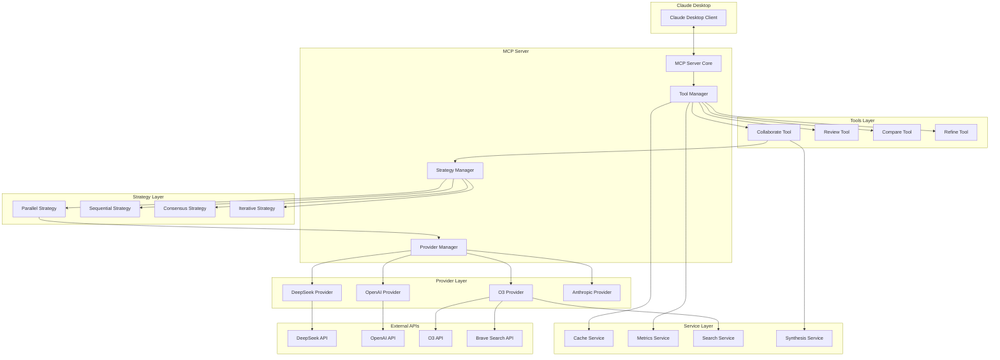
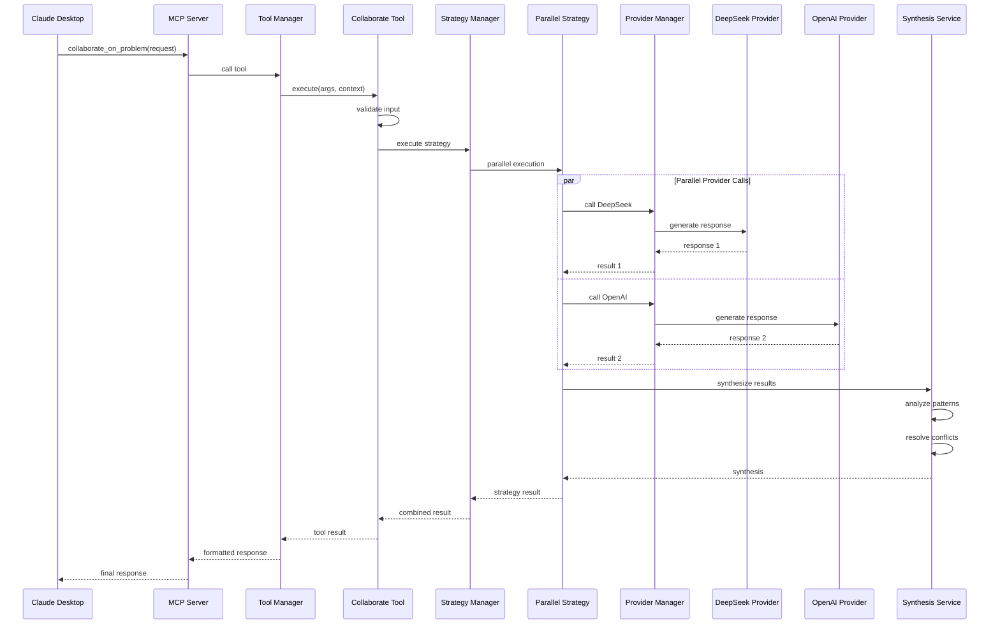

# 技術仕様書 - Claude Code AI Collaboration MCP Server

## アーキテクチャ概要

### システム構成図



## 詳細技術仕様

### 1. プロジェクト構造

```
claude-code-ai-collab-mcp/
├── src/
│   ├── index.ts                      # エントリーポイント
│   ├── server.ts                     # MCPサーバーメインクラス
│   ├── types/                        # 型定義
│   │   ├── index.ts
│   │   ├── common.ts                 # 基本型定義
│   │   ├── interfaces.ts             # インターフェース定義
│   │   └── schemas.ts                # JSONスキーマ定義
│   ├── core/                         # コアシステム
│   │   ├── container.ts              # DI コンテナ
│   │   ├── logger.ts                 # ログシステム
│   │   ├── config.ts                 # 設定管理
│   │   ├── error-manager.ts          # エラー管理
│   │   └── lifecycle.ts              # ライフサイクル管理
│   ├── providers/                    # AI プロバイダー
│   │   ├── base-provider.ts          # 基底プロバイダークラス
│   │   ├── provider-factory.ts       # プロバイダーファクトリー
│   │   ├── provider-manager.ts       # プロバイダーマネージャー
│   │   └── implementations/          # 具体的な実装
│   │       ├── deepseek/
│   │       │   ├── index.ts
│   │       │   ├── client.ts
│   │       │   └── provider.ts
│   │       ├── openai/
│   │       │   ├── index.ts
│   │       │   ├── client.ts
│   │       │   └── provider.ts
│   │       ├── o3/
│   │       │   ├── index.ts
│   │       │   ├── client.ts
│   │       │   ├── provider.ts
│   │       │   └── search.ts
│   │       └── anthropic/
│   │           ├── index.ts
│   │           ├── client.ts
│   │           └── provider.ts
│   ├── strategies/                   # 実行戦略
│   │   ├── base-strategy.ts          # 基底戦略クラス
│   │   ├── strategy-manager.ts       # 戦略マネージャー
│   │   ├── parallel-strategy.ts      # 並列実行
│   │   ├── sequential-strategy.ts    # 順次実行
│   │   ├── consensus-strategy.ts     # 合意形成
│   │   └── iterative-strategy.ts     # 反復改善
│   ├── tools/                        # MCP ツール
│   │   ├── base-tool.ts              # 基底ツールクラス
│   │   ├── tool-manager.ts           # ツールマネージャー
│   │   ├── collaborate-tool.ts       # 協調問題解決ツール
│   │   ├── review-tool.ts            # コードレビューツール
│   │   ├── compare-tool.ts           # 解決策比較ツール
│   │   └── refine-tool.ts            # 反復改善ツール
│   ├── services/                     # サービス層
│   │   ├── cache/                    # キャッシュサービス
│   │   │   ├── cache-manager.ts
│   │   │   ├── memory-cache.ts
│   │   │   ├── redis-cache.ts
│   │   │   └── file-cache.ts
│   │   ├── metrics/                  # メトリクスサービス
│   │   │   ├── metrics-collector.ts
│   │   │   ├── prometheus-exporter.ts
│   │   │   └── health-checker.ts
│   │   ├── search/                   # 検索サービス
│   │   │   ├── search-engine.ts
│   │   │   ├── brave-search.ts
│   │   │   └── result-processor.ts
│   │   └── synthesis/                # 結果統合サービス
│   │       ├── synthesis-service.ts
│   │       ├── pattern-analyzer.ts
│   │       └── conflict-resolver.ts
│   ├── middleware/                   # ミドルウェア
│   │   ├── auth.ts                   # 認証
│   │   ├── validation.ts             # バリデーション
│   │   ├── rate-limiter.ts           # レート制限
│   │   └── request-logger.ts         # リクエストログ
│   └── utils/                        # ユーティリティ
│       ├── id-generator.ts           # ID生成
│       ├── retry.ts                  # リトライ機能
│       ├── validators.ts             # バリデーター
│       ├── formatters.ts             # フォーマッター
│       └── constants.ts              # 定数
├── config/                           # 設定ファイル
│   ├── default.yaml
│   ├── development.yaml
│   ├── production.yaml
│   └── schema.yaml
├── tests/                            # テスト
│   ├── unit/                         # ユニットテスト
│   ├── integration/                  # 統合テスト
│   ├── e2e/                         # E2Eテスト
│   ├── fixtures/                     # テストデータ
│   └── utils/                        # テストユーティリティ
├── scripts/                          # スクリプト
│   ├── build.ts
│   ├── validate-config.ts
│   └── generate-types.ts
├── package.json
├── tsconfig.json
├── jest.config.js
├── .eslintrc.js
├── .prettierrc
└── README.md
```

### 2. 依存関係一覧

#### 核心依存関係
```json
{
  "dependencies": {
    "@modelcontextprotocol/sdk": "^0.4.0",
    "inversify": "^6.0.2",
    "winston": "^3.11.0",
    "config": "^3.3.9",
    "axios": "^1.6.0",
    "ajv": "^8.12.0",
    "lodash": "^4.17.21",
    "uuid": "^9.0.1",
    "yaml": "^2.3.4",
    "reflect-metadata": "^0.1.13"
  },
  "devDependencies": {
    "@types/node": "^20.10.0",
    "@types/uuid": "^9.0.7",
    "@types/lodash": "^4.14.202",
    "typescript": "^5.3.0",
    "jest": "^29.7.0",
    "@types/jest": "^29.5.8",
    "ts-jest": "^29.1.1",
    "eslint": "^8.55.0",
    "@typescript-eslint/eslint-plugin": "^6.14.0",
    "@typescript-eslint/parser": "^6.14.0",
    "prettier": "^3.1.0",
    "ts-node": "^10.9.1",
    "nodemon": "^3.0.2"
  },
  "optionalDependencies": {
    "redis": "^4.6.0",
    "prom-client": "^15.1.0"
  }
}
```

### 3. TypeScript 設定

#### tsconfig.json
```json
{
  "compilerOptions": {
    "target": "ES2022",
    "module": "commonjs",
    "lib": ["ES2022"],
    "outDir": "./dist",
    "rootDir": "./src",
    "strict": true,
    "esModuleInterop": true,
    "skipLibCheck": true,
    "forceConsistentCasingInFileNames": true,
    "declaration": true,
    "declarationMap": true,
    "sourceMap": true,
    "removeComments": true,
    "noImplicitAny": true,
    "noImplicitReturns": true,
    "noImplicitThis": true,
    "noUnusedLocals": true,
    "noUnusedParameters": true,
    "exactOptionalPropertyTypes": true,
    "noImplicitOverride": true,
    "resolveJsonModule": true,
    "experimentalDecorators": true,
    "emitDecoratorMetadata": true,
    "baseUrl": ".",
    "paths": {
      "@/*": ["src/*"],
      "@/types/*": ["src/types/*"],
      "@/core/*": ["src/core/*"],
      "@/providers/*": ["src/providers/*"],
      "@/tools/*": ["src/tools/*"],
      "@/services/*": ["src/services/*"],
      "@/utils/*": ["src/utils/*"]
    }
  },
  "include": ["src/**/*"],
  "exclude": ["node_modules", "dist", "tests"]
}
```

### 4. ESLint 設定

#### .eslintrc.js
```javascript
module.exports = {
  parser: '@typescript-eslint/parser',
  parserOptions: {
    project: 'tsconfig.json',
    tsconfigRootDir: __dirname,
    sourceType: 'module',
  },
  plugins: ['@typescript-eslint'],
  extends: [
    'eslint:recommended',
    '@typescript-eslint/recommended',
    '@typescript-eslint/recommended-requiring-type-checking',
  ],
  root: true,
  env: {
    node: true,
    jest: true,
  },
  ignorePatterns: ['.eslintrc.js'],
  rules: {
    '@typescript-eslint/interface-name-prefix': 'off',
    '@typescript-eslint/explicit-function-return-type': 'error',
    '@typescript-eslint/explicit-module-boundary-types': 'error',
    '@typescript-eslint/no-explicit-any': 'warn',
    '@typescript-eslint/no-unused-vars': 'error',
    '@typescript-eslint/no-floating-promises': 'error',
    '@typescript-eslint/prefer-nullish-coalescing': 'error',
    '@typescript-eslint/prefer-optional-chain': 'error',
    'prefer-const': 'error',
    'no-var': 'error',
  },
};
```

### 5. Jest 設定

#### jest.config.js
```javascript
module.exports = {
  preset: 'ts-jest',
  testEnvironment: 'node',
  roots: ['<rootDir>/src', '<rootDir>/tests'],
  testMatch: [
    '**/__tests__/**/*.ts',
    '**/?(*.)+(spec|test).ts'
  ],
  transform: {
    '^.+\\.ts$': 'ts-jest',
  },
  collectCoverageFrom: [
    'src/**/*.ts',
    '!src/**/*.d.ts',
    '!src/index.ts',
  ],
  coverageDirectory: 'coverage',
  coverageReporters: [
    'text',
    'lcov',
    'html'
  ],
  coverageThreshold: {
    global: {
      branches: 80,
      functions: 80,
      lines: 80,
      statements: 80
    }
  },
  setupFilesAfterEnv: ['<rootDir>/tests/setup.ts'],
  moduleNameMapping: {
    '^@/(.*)$': '<rootDir>/src/$1'
  },
  testTimeout: 30000
};
```

### 6. データフロー仕様

#### シーケンス図：協調問題解決



### 7. エラーハンドリング仕様

#### エラー階層
```typescript
abstract class BaseError extends Error {
  abstract readonly code: string;
  abstract readonly httpStatus: number;
  readonly timestamp: string;
  readonly context?: Record<string, any>;
  
  constructor(message: string, context?: Record<string, any>) {
    super(message);
    this.name = this.constructor.name;
    this.timestamp = new Date().toISOString();
    this.context = context;
  }
}

// プロバイダーエラー
class ProviderError extends BaseError {
  readonly provider: string;
}

class RateLimitError extends ProviderError {
  readonly code = 'RATE_LIMIT_ERROR';
  readonly httpStatus = 429;
  readonly retryAfter?: number;
}

class AuthenticationError extends ProviderError {
  readonly code = 'AUTH_ERROR';
  readonly httpStatus = 401;
}

// ツールエラー
class ToolError extends BaseError {}

class ValidationError extends ToolError {
  readonly code = 'VALIDATION_ERROR';
  readonly httpStatus = 400;
  readonly errors: ValidationResult[];
}

// システムエラー
class SystemError extends BaseError {}

class ConfigurationError extends SystemError {
  readonly code = 'CONFIG_ERROR';
  readonly httpStatus = 500;
}
```

### 8. パフォーマンス要件

#### レスポンス時間目標
- 単一プロバイダー呼び出し: < 10秒
- 並列実行（3プロバイダー）: < 15秒
- キャッシュヒット: < 100ms
- 設定読み込み: < 50ms

#### スループット目標
- 同時リクエスト処理: 10リクエスト
- プロバイダー呼び出し: 100回/分（プロバイダーあたり）

#### メモリ使用量
- ベースメモリ: < 100MB
- 最大メモリ: < 500MB
- キャッシュサイズ: 設定可能（デフォルト100MB）

### 9. セキュリティ仕様

#### API キー管理
- 環境変数からの読み込み
- 設定ファイルでの平文保存禁止
- ログでのマスキング

#### 入力検証
- JSON Schema バリデーション
- SQLインジェクション対策
- XSS対策（HTMLエスケープ）

#### レート制限
```typescript
interface RateLimitConfig {
  requests: number;
  period: number; // milliseconds
  burst?: number;
  strategy: 'sliding-window' | 'fixed-window' | 'token-bucket';
}
```

### 10. 監視・ログ仕様

#### ログレベル
- **FATAL**: システム停止レベルのエラー
- **ERROR**: 機能に影響するエラー
- **WARN**: 注意が必要な状況
- **INFO**: 一般的な情報
- **DEBUG**: 詳細なデバッグ情報

#### メトリクス
```typescript
interface Metrics {
  // パフォーマンス
  request_duration_seconds: Histogram;
  provider_response_time: Histogram;
  cache_hit_ratio: Gauge;
  
  // エラー
  error_count: Counter;
  provider_errors: Counter;
  
  // リソース
  memory_usage: Gauge;
  active_connections: Gauge;
  queue_size: Gauge;
}
```

### 11. テスト戦略

#### ユニットテスト
- すべてのクラス・関数のテスト
- モック・スタブの活用
- エッジケースのテスト
- エラーハンドリングのテスト

#### 統合テスト
- コンポーネント間の連携テスト
- データベース・キャッシュとの統合
- 外部API（モック）との統合

#### E2Eテスト
- 実際のワークフローのテスト
- MCPプロトコルでの通信テスト
- エラーリカバリのテスト

#### パフォーマンステスト
- 負荷テスト
- ストレステスト
- メモリリークテスト

### 12. デプロイメント仕様

#### 環境
- **Development**: ローカル開発環境
- **Staging**: 本番前テスト環境
- **Production**: 本番環境

#### 設定管理
```yaml
# 環境別設定の例
development:
  providers:
    - name: deepseek
      enabled: true
      timeout: 60000
  cache:
    type: memory
    
production:
  providers:
    - name: deepseek
      enabled: true
      timeout: 30000
  cache:
    type: redis
  monitoring:
    enabled: true
```

この技術仕様書は実装過程で詳細化・更新されます。